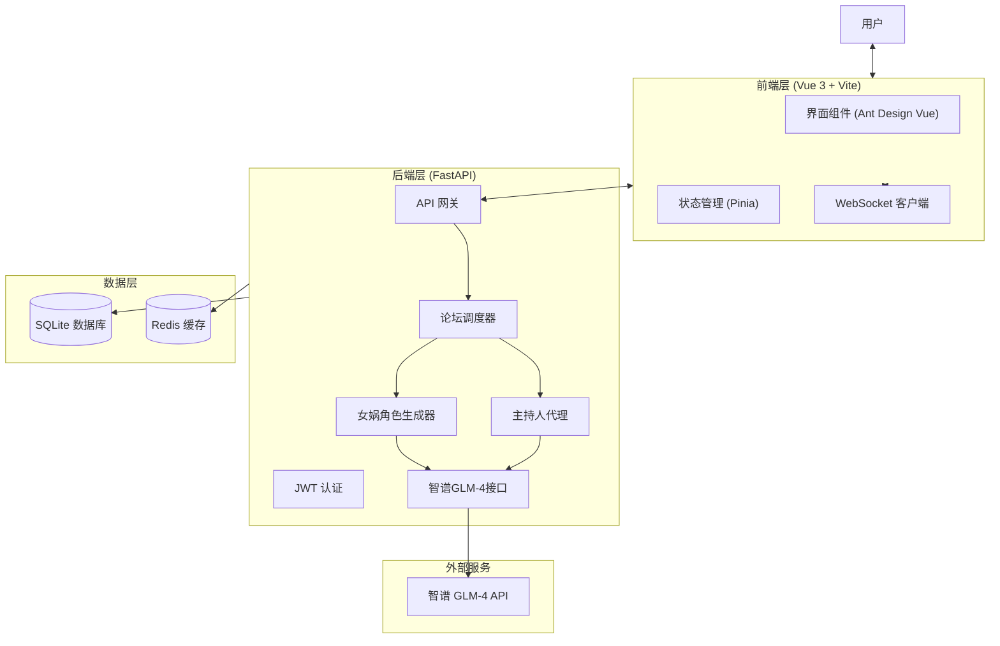

# 🌊 智渡 - 智能圆桌论坛平台

> **让知识不再有边界，让思想碰撞产生火花。**

---

## 🌟 项目简介

**智渡**是一个基于大语言模型的沉浸式多智能体圆桌讨论平台，致力于为用户提供高质量的知识学习、专家咨询和思想碰撞空间。在这里，你可以与各领域的AI专家进行实时讨论，获取专业见解，拓展知识边界。

无论你是学生、研究者还是职场人士，智渡都能为你提供：
- 🎓 **专家圆桌会议**：邀请各领域AI专家针对特定话题展开深度讨论
- 🧠 **智能助手生成**：基于真实资料生成专业领域的智能助手
- 💡 **知识深度研讨**：就复杂问题进行多维度、多角度的分析
- 📚 **学习辅助工具**：论文解读、方案评审、决策辅助等多功能支持

---

## 🎯 核心特性

### 🤖 真实角色生成系统（女娲智能）
- 基于ReAct框架，智能体能够主动搜索互联网获取真实人物生平、理论和观点
- 生成的角色具有真实的知识背景、性格特点和立场倾向
- 支持自定义创建特定领域的专家角色

### 💬 沉浸式圆桌讨论
- 动态主持人机制，确保讨论有序进行，不偏离主题
- 双层记忆系统：智能体拥有独立思考记忆和共享讨论上下文
- WebSocket实时流式输出，实现流畅的"打字机"效果
- 支持多角色同时讨论，模拟真实圆桌会议氛围

### 🎨 现代化界面设计
- 采用清新的**青蓝紫渐变**配色方案，视觉舒适且富有科技感
- 响应式设计，完美适配桌面端和移动端
- 丰富的微交互动效，提升用户体验
- 简洁直观的操作流程，降低使用门槛

### 🔒 安全可靠
- 完整的用户权限系统，数据安全可靠
- 所有AI生成内容均标注来源提示，避免误导
- 支持数据导出和备份，保障用户权益

---

## 🏗️ 技术架构

智渡采用现代化前后端分离架构，性能优异，易于扩展：



### 技术栈
| 层级 | 技术选型 | 版本要求 |
|------|----------|----------|
| 前端 | Vue 3 + TypeScript + Vite | Node.js 18+ |
| 后端 | Python 3.10+ + FastAPI | Python 3.10+ |
| 数据库 | SQLite + Redis | 无需额外安装 |
| 部署 | Docker + Nginx | 支持容器化一键部署 |

---

## 🚀 快速开始

### 方式一：Docker 一键部署（推荐）
```bash
# 1. 克隆项目
git clone https://github.com/你的用户名/ZhiDu.git
cd ZhiDu

# 2. 配置环境变量
cp .env.example .env
# 编辑 .env 文件，填入你的智谱AI API Key
# API_KEY=你的智谱APIKey

# 3. 启动服务
docker-compose up -d

# 4. 访问平台
# 前端地址：http://localhost
# 后端地址：http://localhost:8000
```

### 方式二：本地开发启动
```bash
# 1. 启动后端
cd ZhiDu
python -m venv venv
# Windows: venv\Scripts\activate
# Mac/Linux: source venv/bin/activate
pip install -r requirements.txt
uvicorn app.main:app --reload --host 0.0.0.0 --port 8000

# 2. 启动前端
cd frontend
npm install
npm run dev

# 3. 访问
# 前端：http://localhost:5173
# 后端API：http://localhost:8000
```

### 环境变量配置
在 `.env` 文件中配置以下参数：
```ini
# 智谱AI配置
API_KEY=your_zhipu_api_key_here
MODEL_NAME=glm-4.5
BASE_URL=https://open.bigmodel.cn/api/paas/v4/

# 安全配置
SECRET_KEY=your_secret_key_here
ACCESS_TOKEN_EXPIRE_MINUTES=10080
```

---

## 📖 使用指南

### 1. 创建账号
- 访问平台首页，点击注册按钮创建账号
- 登录后进入主界面

### 2. 创建智能助手
- 进入"智能体工坊"页面
- 点击"创建智能体"，描述你想要的助手特征
- 系统会自动联网搜索生成专业的智能助手

### 3. 发起圆桌讨论
- 进入"圆桌论坛"页面
- 点击"创建论坛"，设置讨论主题、参与角色、讨论时长
- 开始讨论，观察各专家的观点碰撞

### 4. 使用助手仓库
- 进入"助手仓库"，浏览系统预置的各领域专家
- 可以直接添加到自己的智能体工坊使用

---

## 🤝 贡献指南

欢迎提交Issue和Pull Request来改进这个项目！

### 开发规范
- 前端代码遵循Vue 3 Composition API规范
- 后端代码遵循PEP8 Python编码规范
- 提交信息格式：`type: 描述内容`（feat/fix/docs/style/refactor）

### 开发计划
- [ ] 支持更多LLM模型接入
- [ ] 增加用户角色分享功能
- [ ] 优化移动端体验
- [ ] 增加讨论内容导出功能
- [ ] 支持多人同时参与讨论

---

## ⚠️ 免责声明

1. 本系统生成的AI角色发言仅为模拟生成，可能包含错误、误导性信息或虚构内容
2. 所有生成内容不代表真实人物观点，仅供学习研究和娱乐演示使用
3. 请勿将生成内容作为专业建议，涉及专业领域请咨询相关专业人士
4. 使用本系统产生的任何后果由使用者自行承担

---

## 📄 许可证

本项目采用 MIT 开源许可证，详见 [LICENSE](LICENSE) 文件。

---

## 🙏 致谢

- 感谢智谱AI提供强大的GLM-4大模型支持
- 感谢所有开源贡献者的努力
- 感谢所有用户的使用和反馈

---

**💖 智渡 - 让智能为生活赋能，让知识触手可及**
