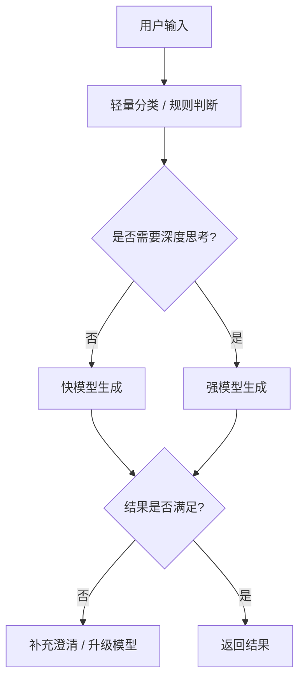

# 智能体调用策略：效果与成本平衡版

本文档给出一套可直接落地的智能体调用逻辑，目标是在保证回答质量的前提下，尽量压低 token、响应时延和上游失败率。

适用场景：
- 单个智能体的一对一对话
- 论坛/圆桌中的多智能体讨论
- 智能体仓库中的“单独对话”入口
- 需要统一接入不同模型供应商时的路由层

## 1. 设计原则

1. 先分流，再生成。
   - 不要让所有请求都走高成本模型。
   - 先用轻量分类器或规则判断“这次是否值得深度思考”。

2. 默认快速，必要时升级。
   - 大部分普通问答、闲聊、澄清都用快模型。
   - 复杂推理、代码、多约束规划、高风险内容再升级到强模型。

3. 把“思考成本”集中在少数关键时刻。
   - 不要每轮都开启最强推理。
   - 不要把论坛每个智能体的每次发言都当成深度推理任务。

4. 上下文越长，越要先压缩。
   - 长历史不要无脑全塞给模型。
   - 先做摘要，再继续对话。

5. 失败要降级，不要卡死。
   - 429 / timeout / upstream error 都要有降级模型和兜底话术。

## 2. 模型分层建议

建议把模型按职责分成 4 层。模型名称不固定，可以替换成任意供应商的等价产品。

### 2.1 A 层：强推理模型

用途：
- 复杂分析
- 多约束规划
- 需要高准确率的最终回答
- 论坛中的总结、裁决、冲突调和

特征：
- 成本更高
- 延迟更大
- 适合低频调用

建议只在以下场景使用：
- 用户明确要求“深入分析”“详细推导”“方案比较”
- 轻量模型已经判断不够
- 经过两轮澄清后仍然无法稳定回答
- 需要给出最终结论、总结、裁判意见

### 2.2 B 层：主力对话模型

用途：
- 日常单聊
- 大多数论坛发言
- 一般问答、解释、改写、轻度规划

特征：
- 性价比最高的主力层
- 负责绝大多数请求

建议作为默认模型：
- 大多数“直接回答型”请求都走它
- 论坛中每个智能体的常规发言都先走它

### 2.3 C 层：廉价模型 / 摘要模型

用途：
- 意图识别
- 历史摘要
- 长上下文压缩
- 简单重写
- 失败后快速兜底

特征：
- 便宜、快
- 适合高频短任务

建议用途：
- 用户问题分类
- 对话历史压缩成 300 到 800 字摘要
- 论坛轮次摘要
- 生成“下一步要不要升级”的判断理由

### 2.4 D 层：多模态模型

用途：
- 图片理解
- 截图问答
- 图文混合上下文

特征：
- 只在有图片时启用
- 没图就不要走

## 3. 路由总流程

推荐的调用总流程如下：

### 3.1 第一步：轻量分类

先判断这条请求属于哪一类：
- 普通问答
- 需要澄清
- 需要总结
- 需要推理
- 需要多模态
- 需要工具调用
- 需要论坛发言

推荐分类方式：
- 规则优先
- 轻量模型辅助

规则可以先看：
- 是否包含“分析 / 比较 / 方案 / 原因 / 规划 / 代码 / 调优 / 设计”
- 是否是单句闲聊
- 是否是图片输入
- 是否是多轮追问
- 是否是论坛总结/主持/裁决

### 3.2 第二步：选择模型

建议按以下优先级：

1. 图片或图文输入
   - 走多模态模型

2. 明显高复杂度请求
   - 走强推理模型

3. 常规对话、论坛发言、普通问答
   - 走主力快模型

4. 摘要、分类、压缩、短重写
   - 走廉价模型

### 3.3 第三步：上下文组装

不要把所有历史都原封不动传给模型。

建议做法：
- 最近 6 到 12 轮保留原文
- 更早内容压成摘要
- 角色设定、人格卡片、系统提示词单独保留
- 论坛场景中只带必要参与者信息，不带全部场外噪声

### 3.4 第四步：生成后检查

模型返回后做快速检查：
- 是否为空
- 是否超短且无信息
- 是否明显偏题
- 是否包含不安全内容

如果失败：
- 先用同级模型重试一次
- 再降级到备用模型
- 最后给用户稳定的兜底回复

## 4. 单聊场景建议

单聊场景分为两条路径：

### 4.1 普通问答路径

适用：
- 日常提问
- 角色问答
- 轻度建议
- 简单解释

推荐逻辑：
1. 先用快模型
2. 如果回答过短、含糊、跑题，再升级
3. 如果用户追问两次以上，再升级强推理模型

### 4.2 高复杂度路径

适用：
- 多条件方案比较
- 深度分析
- 代码诊断
- 需要权衡取舍的问题

推荐逻辑：
1. 用强推理模型
2. 限制输出长度
3. 结果尽量结构化

## 5. 论坛场景建议

论坛比单聊更容易烧 token，因为参与者多、轮次多、历史长。

建议把论坛逻辑分成 3 段：

### 5.1 主题开启

- 用快模型生成开场
- 不要上来就让所有人深度推理

### 5.2 中间轮次

每个智能体发言前先判断：
- 这轮是否真的需要发言
- 是否只是附和
- 是否能由更少的参与者回答

建议：
- 默认快模型
- 只在关键分歧点升级强模型

### 5.3 总结收口

- 用强推理模型或质量更高的总结模型
- 只在最后一轮使用
- 输出四段式总结：
  - 议题脉络
  - 共识
  - 分歧
  - 未解决问题

## 6. 成本控制手段

### 6.1 控制 token 上限

建议参考值：
- 普通单聊：`256 ~ 512`
- 解释型回答：`512 ~ 768`
- 深度分析：`768 ~ 1536`
- 总结/摘要：`256 ~ 512`

### 6.2 历史压缩

建议：
- 超过阈值就摘要
- 不要把完整长对话持续塞进 prompt
- 对用户身份、角色设定、论坛目标做“静态缓存”

### 6.3 分层缓存

可缓存内容：
- 智能体系统提示词
- 人设卡
- 论坛主题
- 近期摘要

不建议缓存：
- 逐轮临时草稿
- 带强时效性的上下文

### 6.4 失败降级

建议降级链路：
1. 强模型
2. 主力模型
3. 廉价模型
4. 固定兜底话术

触发降级的条件：
- 401 / 403
- 429
- timeout
- network error
- 空返回

## 7. 推荐的调用决策表

| 场景 | 首选模型层 | 备用 | 备注 |
| --- | --- | --- | --- |
| 普通单聊 | B 层 | A 层 | 大多数请求都应走这里 |
| 复杂分析 | A 层 | B 层 | 仅在确实需要时启用 |
| 历史摘要 | C 层 | B 层 | 最省钱 |
| 论坛开场 | B 层 | C 层 | 快速起势 |
| 论坛中段发言 | B 层 | A 层 | 关键分歧才升级 |
| 论坛总结 | A 层 | B 层 | 最后收口 |
| 图片问答 | D 层 | B 层 | 只在有图时启用 |

## 8. 结合你当前仓库的落地建议

你现在的仓库里已经有两条核心链路：

- 单聊：`/agents/chat/stream`
- 论坛：调度器里的 `think -> speak`

建议直接按下面方式映射：

### 8.1 单聊

- 默认走主力快模型
- 用户明显要求深入分析时，升级强推理模型
- 轮次过长时，先摘要再继续

### 8.2 论坛

- `think` 只用于“是否发言”的决策
- `speak` 才是真正生成内容
- `think` 用更便宜的模型
- `speak` 默认用主力模型
- 只有总结和关键分歧点才切强模型

### 8.3 智能体仓库的“单独对话”

- 默认只绑定一个智能体
- 只在用户点击发送时调用模型
- 先用主力模型
- 不要为了展示“思考中”就额外多调一次模型

## 9. 推荐的最小实现策略

如果你只想先做一个“够用且省钱”的版本，建议是：

1. 轻量分类器
   - 规则优先，必要时才问小模型

2. 默认主力快模型
   - 负责 80% 以上请求

3. 强推理模型只保留给 20% 的复杂请求

4. 历史摘要常驻
   - 一旦对话过长就压缩

5. 论坛总结单独走高质量模型

6. 所有失败统一降级

## 10. 推荐的策略总结

一句话概括：

> 用便宜模型做判断和压缩，用中档模型做大多数回答，用强模型处理少量高价值难题。

这套方式通常能把成本控制在一个比较合理的范围，同时保证：
- 普通用户感知更快
- 复杂问题质量更稳
- 论坛多智能体不会无意义烧 token
- 出错时能平滑降级

如果你要，我可以下一步把这份文档继续细化成“按你仓库现有接口的实际配置表”，直接列出每个接口该走哪一层模型、`max_tokens` 设多少、是否开启 `thinking`。 
